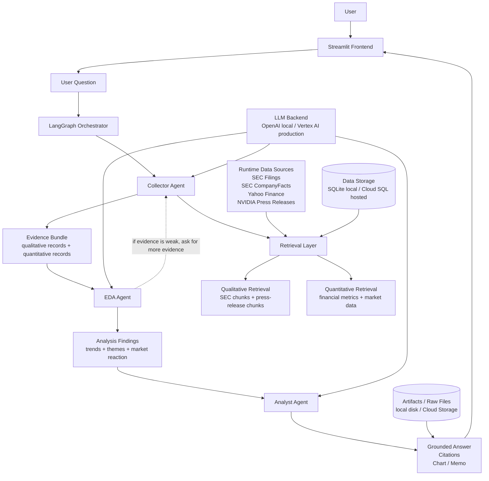

# Project 2: Company Data Analyst Agent

Company data analyst agent with explicit `Collect -> Explore / Analyze -> Hypothesize` stages.

## Live App

- Public URL:
  - `https://project2-company-data-analyst-agent-555207000332.us-central1.run.app`

## What This App Does

- Collects real external company data at runtime from:
  - SEC filings
  - SEC CompanyFacts
  - Yahoo Finance market data
  - NVIDIA press releases
- Runs a LangGraph multi-agent workflow:
  - `Collector Agent`
  - `EDA Agent`
  - `Analyst Agent`
- Uses two retrieval methods:
  - qualitative retrieval over filing / press-release chunks
  - quantitative retrieval over structured financial and market rows
- Produces grounded analyst-style answers with explicit evidence, EDA findings, and visualizations

## High-Level Architecture



At a high level, the `Collector Agent` gathers evidence through the retrieval layer, packages it into an `Evidence Bundle`, the `EDA Agent` turns that into `Analysis Findings`, and the `Analyst Agent` uses both as input for the final grounded answer shown in the frontend.

## Run Locally

1. Create a virtual environment and activate it.
2. Install the project:

   ```bash
   pip install -e .
   ```

3. Create a `.env` file. Minimum useful settings:

   ```bash
   OPENAI_API_KEY=...
   OPENAI_MODEL=gpt-4.1-mini
   DEFAULT_TICKER=NVDA
   ```

4. Launch the Streamlit app:

   ```bash
   streamlit run streamlit_app.py
   ```

The app can work with deterministic routing and analysis even if the LLM is unavailable, but the final narrative is better with a configured model.

## Core Workflow

The graph above is the system-level view. The stage-by-stage workflow below maps the homework requirements directly to the code.

### Collect

The `Collector Agent` gathers the evidence needed for the question before any conclusion is written.

- Refresh + collection:
  - [pipelines/refresh_company.py](./pipelines/refresh_company.py) `refresh_company_data`
  - [agents/tools.py](./agents/tools.py) `refresh_company_data_tool`
- SEC filings:
  - [pipelines/sec_client.py](./pipelines/sec_client.py) `fetch_recent_filings`
- CompanyFacts:
  - [pipelines/companyfacts_client.py](./pipelines/companyfacts_client.py) `fetch_companyfacts`
- Market data:
  - [pipelines/market_data.py](./pipelines/market_data.py) `fetch_market_history`
- Press releases:
  - [pipelines/press_releases.py](./pipelines/press_releases.py) `fetch_press_releases`
- Document processing into chunks:
  - [pipelines/text_processing.py](./pipelines/text_processing.py) `process_company_documents`

### Explore / Analyze

The `EDA Agent` must call tools over retrieved data before the final answer is formed.

- Workflow:
  - [graph/workflow.py](./graph/workflow.py) `_eda_node`
- Retrieval tools:
  - [agents/tools.py](./agents/tools.py) `retrieve_document_context_tool`
  - [agents/tools.py](./agents/tools.py) `retrieve_financial_metrics_tool`
  - [agents/tools.py](./agents/tools.py) `retrieve_market_data_tool`
- EDA tools:
  - [agents/tools.py](./agents/tools.py) `financial_trend_tool`
  - [agents/tools.py](./agents/tools.py) `market_reaction_tool`
  - [agents/tools.py](./agents/tools.py) `text_theme_tool`
  - [agents/tools.py](./agents/tools.py) `chart_tool`

### Hypothesize

The `Analyst Agent` synthesizes the evidence and EDA findings into a grounded answer with citations.

- Workflow:
  - [graph/workflow.py](./graph/workflow.py) `_analyst_node`
- Final answer construction:
  - [agents/tools.py](./agents/tools.py) `final_answer_builder`

## Homework Requirement Mapping

### Required

- `Frontend`
  - [streamlit_app.py](./streamlit_app.py)
- `Agent framework`
  - [graph/workflow.py](./graph/workflow.py) uses LangGraph
- `Tool calling`
  - [agents/tools.py](./agents/tools.py)
  - tools are invoked inside [graph/workflow.py](./graph/workflow.py)
- `Non-trivial dataset`
  - runtime SEC, CompanyFacts, market data, and press-release collection in [pipelines/](./pipelines)
- `Multi-agent pattern`
  - `Collector -> EDA -> Analyst` in [graph/workflow.py](./graph/workflow.py)
- `Deployed`
  - live Cloud Run app:
    - `https://project2-company-data-analyst-agent-555207000332.us-central1.run.app`
  - deployment files:
    - [Dockerfile](./Dockerfile)
    - [cloudbuild.yaml](./cloudbuild.yaml)
- `README`
  - this file

### Electives Implemented

- `Second data retrieval method`
  - qualitative chunk retrieval in [storage/query_service.py](./storage/query_service.py) `search_document_chunks`
  - quantitative structured retrieval in [storage/query_service.py](./storage/query_service.py) `fetch_financial_metrics` and `fetch_market_data`
- `Code execution`
  - pandas-driven EDA in [agents/tools.py](./agents/tools.py) `financial_trend_tool` and `market_reaction_tool`
- `Data visualization`
  - chart generation in [agents/tools.py](./agents/tools.py) `chart_tool`
  - chart rendering in [streamlit_app.py](./streamlit_app.py)
- `Artifacts`
  - artifact writing in [app/artifacts.py](./app/artifacts.py)

## Retrieval Design

### Qualitative retrieval

Used for narrative or risk questions.

- Data:
  - SEC filing chunks
  - press-release chunks
- Storage:
  - SQLite `chunks`
- Retrieval:
  - [storage/query_service.py](./storage/query_service.py) `search_document_chunks`

### Quantitative retrieval

Used for financial and market questions.

- Data:
  - CompanyFacts-derived financial metric rows
  - market data rows
- Storage:
  - SQLite `financial_metrics`
  - SQLite `market_data`
- Retrieval:
  - [storage/query_service.py](./storage/query_service.py) `fetch_financial_metrics`
  - [storage/query_service.py](./storage/query_service.py) `fetch_market_data`

## Key Files

- Streamlit app:
  - [streamlit_app.py](./streamlit_app.py)
- LangGraph workflow:
  - [graph/workflow.py](./graph/workflow.py)
- Tool layer:
  - [agents/tools.py](./agents/tools.py)
- Optional LLM helper:
  - [agents/llm.py](./agents/llm.py)
- Agent prompts:
  - [prompts/agent_prompts.py](./prompts/agent_prompts.py)
- Query helpers:
  - [storage/query_service.py](./storage/query_service.py)
- Artifact handling:
  - [app/artifacts.py](./app/artifacts.py)

## Cloud Deployment

The hosted target is Google Cloud.

### Planned production stack

- App + Streamlit frontend: Cloud Run
- Model provider: Vertex AI Gemini
- Secrets: Secret Manager
- Raw docs and artifacts: Cloud Storage
- Structured data: Cloud SQL
- CI/CD: GitHub -> Cloud Build -> Cloud Run

### Files added for deployment

- [Dockerfile](./Dockerfile)
- [cloudbuild.yaml](./cloudbuild.yaml)
- [storage/cloud.py](./storage/cloud.py)

### Typical deployment path

1. Build and verify locally.
2. Containerize the app with Docker.
3. Deploy the container to Cloud Run.
4. Configure env vars / secrets / service account.
5. Move artifacts to Cloud Storage and structured data to Cloud SQL for production persistence.

## Notes

- The strongest fully supported path is still `NVDA`.
- New tickers can now be refreshed through SEC filings, SEC CompanyFacts, and market data.
- Press-release collection is currently company-specific and strongest for `NVDA`.
- Event extraction is intentionally deferred until the core analyst loop is stable.
